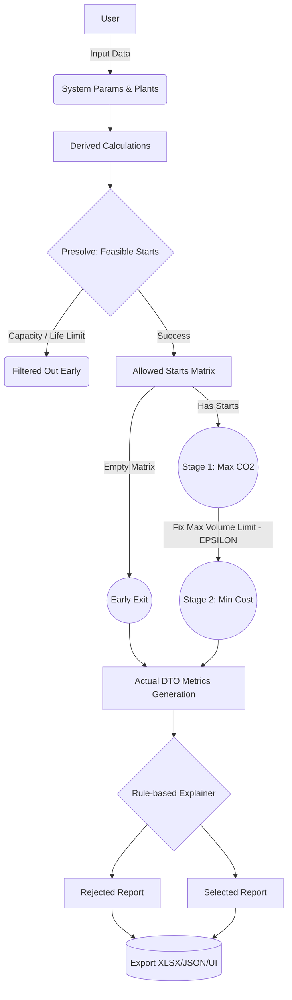

# CCS Hub Optimization Logic and Algorithm

This document provides a step-by-step description of the application's algorithm: the workflow from raw input data to the final decision, which determines which sources should be retrofitted and in which year they should be connected to maximize captured volume and minimize costs.

---

## 🧭 Why is the optimization split into two stages?
Infrastructure optimization projects often face two conflicting objectives: maximizing captured CO₂ volumes and minimizing costs. Combining them into a single mathematical formula requires the introduction of artificial weight coefficients or "penalties" for uncaptured CO₂, which complicates the interpretation of the optimization model.

To solve this problem, the logic of **lexicographic optimization (Two-Stage MILP)** is used:
1. **Stage 1 (Environmental Priority)**: The optimization model does not consider cost. The main goal is to fully utilize the annual hub capacity and the cumulative storage capacity, achieving the highest possible total captured CO₂ volume. We determine the physical limit of the system's capabilities.
2. **Stage 2 (Economic Priority)**: The optimization model takes the achieved maximum captured volume and fixes it as a target constraint. The solver's task is to find the most cost-effective retrofit schedule that still achieves this maximum volume.

---

## 📊 1. Input Parameter Collection
Before starting the calculations, the system receives two blocks of initial data.

**System Parameters:**
- Planning horizon (e.g., 25 years) and start year (e.g., 2025).
- `annual_hub_capacity_mtpy` — the annual hub capacity of the pipeline.
- `cumulative_storage_capacity_mt` — the cumulative storage capacity of the available underground storage.
- `minimum_connection_time_y` — a business constraint: a source is not eligible for connection if it cannot operate in the network for at least the specified minimum connection duration.
- `capture_efficiency` — the physical percentage of gas that can potentially be captured at the source.

**Source Portfolio Parameters (Emitters):**
- Identifier and name.
- `co2_flow_mtpy` — the total annual generated CO₂ emission of the source.
- `capture_cost_euro_per_t` — the specific cost of capturing 1 ton of CO₂ at this source.
- `remaining_life_y` — the remaining lifetime of the source.

---

## 🧮 2. Derived Calculations
The system precomputes derived source parameters to simplify the parameter builder's work:

1. **Captured CO₂ (`captured_co2_mtpy`)** = `co2_flow_mtpy` $\cdot$ `capture_efficiency`
   *The volume that will be sent to the pipeline per year during an active connection.*
2. **Residual CO₂ (`residual_co2_mtpy`)** = `co2_flow_mtpy` - `captured_co2_mtpy`
   *The gas that will be emitted into the atmosphere even with a functioning capture system.*

---

## 🛠️ 3. Presolve Filtering (Feasible Starts)
This is an important preprocessing step. Before formulating equations for the mathematical solver, the algorithm constructs a set of feasible start years, `allowed_starts`.

**Filtering steps (for source $P$ and calculated start year $T_{start}$):**
1. **Annual hub capacity:** If the annual captured volume of a single source exceeds the total `annual_hub_capacity_mtpy`, this source is completely excluded from the calculation.
2. **Remaining lifetime check:** It calculates $Life\_at\_start$, which accounts for the elapsed portion of the source's remaining lifetime from the beginning of the planning horizon to the proposed start year. If the source is decommissioned by this year, the start scenario is discarded.
3. **Operational duration (Duration):** The algorithm deterministically calculates the actual operational duration, which is bounded by either the end of the source's remaining lifetime or the end of the planning horizon:  
   $Duration = \min(Life\_at\_start, \;\;\; Planning\_Horizon - Elapsed)$
4. **Minimum connection duration:** If the calculated $Duration$ is strictly less than the $Minimum\_Connection\_Time$, this feasible start year is excluded.
5. **Global limit (Presolve cutoff):** The cumulative captured CO₂ volume of the source over the calculated $Duration$ is determined. If this volume exceeds the entire `cumulative_storage_capacity_mt`, the start year is removed from the matrix. *Note:* This is a preparatory step; it does not replace the global structural constraint of the mixed-integer linear programming (MILP) model, but improves performance by cutting off inherently infeasible branches.

**Empty Matrix Behavior (Edge Case - Early Exit):**
If, after applying all filters, the `allowed_starts` matrix remains empty (not a single source satisfies the system constraints), an early exit mechanism is provided: the mathematical solver is not called, and the optimization function returns an empty solution (`{}`). The downstream logic routinely interprets this as a scenario with no feasible connections and generates zero resulting metrics for the infrastructure without causing software failures.

---

## 📈 4. Stage 1: Maximize Captured CO₂

**Current Problem Formulation:** The decision variable in the implemented optimization model determines **exclusively the source and its connection year**. The connection duration is *not* an independent variable to be optimized; it is calculated strictly deterministically based on step 3, assuming continuous operation of the source until its decommissioning date or the end of the CCS program. The optimization model evaluates combinations of feasible start years across the source portfolio to find the absolute maximum.

### 4.1. Sets, Indices, and Parameters
- $P$ — the source portfolio (index $p$);
- $T$ — the planning horizon in years (indices $t$ for the start year, $y$ for the evaluated operational year);
- $S_p$ — the pre-filtered set of feasible start years for source $p$;
- $V_p$ — the annual captured CO₂ volume of source $p$;
- $D_{p,t}$ — the actual operational duration of source $p$, if its start occurs in year $t$;
- $A$ — the annual hub capacity constraint;
- $G$ — the cumulative storage capacity constraint.

### 4.2. Decision Variable
Start binary variable:
$x_{p,t} \in \{0, 1\} \quad \forall p \in P, \forall t \in S_p$
If $x_{p,t} = 1$, source $p$ undergoes a CO₂ capture retrofit and is connected in year $t$.

### 4.3. Source Activity Definition
A source starting in year $t$ is considered **active** in the evaluated year $y$ if:
$t \le y < t + D_{p,t}$
The total volume of CO₂ injected from this source will be $V_p \cdot D_{p,t}$.

### 4.4. Mathematical Constraints
- **Constraint 1 (Single Start):** For each source, the algorithm is allowed to select at most one start from the pool $S_p$: $\sum_{t \in S_p} x_{p,t} \le 1$.
- **Constraint 2 (Hub Capacity):** For each year $y$, the sum of volumes from all active sources does not exceed the limit $A$.
- **Constraint 3 (Cumulative Storage):** The cumulative captured CO₂ from all operating sources over the entire planning horizon does not exceed the limit $G$.

**Objective:** Determine the matrix of values $x_{p,t}$ that maximizes the total captured CO₂ volume. This target value is fixed as $MaxVolume_{opt}$.

---

## 💶 5. Stage 2: Capture Cost Minimization

The current stage aims to find the least expensive combination of start years strictly among those scenarios that guarantee the target volume of Stage 1 is met.

### 5.1. Additional Parameters and EPSILON Tolerance
A specific cost parameter $C_{p}$ (Euro/ton) is introduced to calculate the total project expenses:
$TotalCost_{p,t} = V_p \cdot 10^6 \cdot D_{p,t} \cdot C_{p}$

The Stage 2 model contains a copy of Constraints 1–3, to which the key linking condition is added:
$\sum_{p \in P} \sum_{t \in S_p} (x_{p,t} \cdot V_p \cdot D_{p,t}) \ge MaxVolume_{opt} - EPSILON$

**Purpose of the EPSILON parameter (1e-5):**
Because mixed-integer linear programming (MILP) solvers (for example, the CBC algorithm) perform calculations using floating-point arithmetic, strict mathematical equality can break at minor fractional levels. The use of the EPSILON tolerance permits a microscopic deviation from the Stage 1 extremum (1e-5 Mt = 10 tons). This reduces the risk of false infeasibility and problems caused by floating-point rounding, helping to avoid execution failures, though it is not an absolute guarantee of perfect precision in all edge cases of floating-point arithmetic.

**Stage 2 Objective Function**
Capture cost minimization of total expenses $\sum (x_{p,t} \cdot TotalCost_{p,t})$.

### 5.2. Equivalent Optima
Within the current architecture, there is no deterministic tie-breaker. If the model identifies several sets of feasible start years that have the exact same combined captured volume and identical costs, the solver will return any mathematically equivalent optimum depending on the solver's internal search path. A potential logic upgrade (for example, an explicit tie-breaking preference for earlier starts) is a separate functional change requiring future business alignment.

---

## 📋 6. Results Generation (DTO / Interpretation)
The data object generation mechanism translates the decision matrix $x_{p,t}$ into actual business metrics (DTOs), strictly separating the sources selected by the algorithm from the rejected ones.

### 6.1. Selected Sources (`Selected = True`)
For a selected source, the metrics of the specific selected decision are returned:
- The selected start year and the fixed operational duration $D_{p,t}$.
- Calculated metrics of the cumulative captured CO₂ and total costs.

### 6.2. Not Selected Sources (`Selected = False`)
For sources left without a connection to the infrastructure, actual calculated non-connection metrics are passed:
- **`annual_captured_co2_mtpy = 0.0`**
- **`annual_residual_co2_mtpy = full annual generated CO2`** (all gas is emitted into the atmosphere).
- **`cumulative_captured_co2_mt = 0.0`**.
- **`cumulative_residual_co2_mt = annual_generated_co2 * min(remaining_life, planning_horizon)`**
  *Methodological clarification:* This specific metric records the volume of atmospheric emissions solely within the established planning horizon model under the absence of a connection. Accumulated emissions of the source after the planning horizon ends are ignored by this DTO.

---

## 🧠 7. Explainer Module Operation ("Why like this?")
The analytical module `explainer.py` interprets the selected mathematical solution for each source:

- **⚪ Filtered Out Early:** The source was rejected at the preliminary stage (Presolve).
- **🔴 Not Selected:** The source was rejected by the MILP solver due to infrastructural bottlenecks (annual hub capacity or cumulative storage capacity limitations).
- **🟢 Selected:** The source has been successfully integrated. The explainer investigates any starting delays relative to the earliest possible start date.

## 💡 8. Final Process Flow-Chart (Mermaid)

