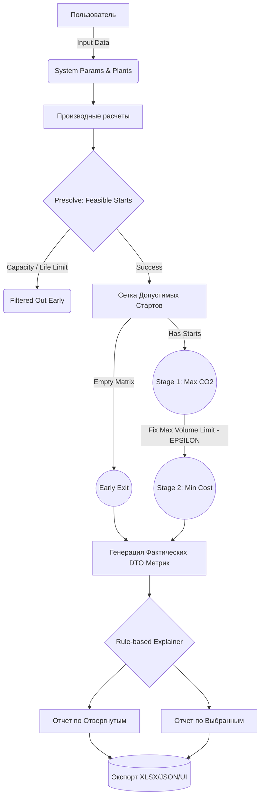

# Логика и Алгоритм Оптимизации CCS Hub

Этот документ пошагово описывает алгоритм работы приложения: путь от исходных данных до итогового решения, определяющего, какие объекты и в какой год необходимо подключить к хабу для максимизации объёма улавливания и минимизации затрат.

---

## 🧭 Почему оптимизация разбита на два этапа?
В проектах оптимизации инфраструктуры часто возникают две конфликтующие цели: максимизация объемов улавливания CO₂ и минимизация расходов. Сведение их в одну математическую формулу требует введения искусственных весовых коэффициентов или "штрафов" за неуловленный газ, что усложняет интерпретацию модели.

Для решения этой задачи используется логика **лексикографической многокритериальной оптимизации (Two-Stage MILP)**:
1. **Этап 1 (Экологический приоритет)**: Алгоритм не учитывает стоимость. Главная цель — максимально утилизировать пропускную способность инфраструктуры и емкость хранилища, получив максимально возможный объем захваченного газа. Мы определяем физический предел возможностей системы.
2. **Этап 2 (Экономический приоритет)**: Алгоритм берет полученный максимум объёма улавливания и фиксирует его как целевое ограничение. Задача решателя — найти наиболее дешевую конфигурацию подключений, которая достигает данного максимального объёма.

---

## 📊 1. Сбор входных параметров
Перед началом расчетов система получает два блока исходных данных.

**Системные параметры:**
- Горизонт планирования (например, 25 лет) и год старта (например, 2025).
- `annual_hub_capacity_mtpy` — пропускная способность трубопровода в год.
- `cumulative_storage_capacity_mt` — общая емкость доступного подземного хранилища.
- `minimum_connection_time_y` — бизнес-ограничение: объект запрещено подключать, если он не способен проработать в сети минимум заданное количество лет подряд.
- `capture_efficiency` — физический процент газа, который потенциально можно уловить на объекте.

**Параметры объектов (Эмиттеров):**
- Идентификатор и название.
- `co2_flow_mtpy` — общий генерируемый выброс объекта в год.
- `capture_cost_euro_per_t` — удельная стоимость улавливания 1 тонны на данном объекте.
- `remaining_life_y` — оставшийся срок эксплуатации объекта.

---

## 🧮 2. Производные расчёты
Система предварительно вычисляет технологические константы объекта для упрощения работы сборщика параметров:

1. **Captured CO₂ (`captured_co2_mtpy`)** = `co2_flow_mtpy` $\cdot$ `capture_efficiency`
   *Объем, который будет направляться в трубопровод в год при рабочем подключении.*
2. **Residual CO₂ (`residual_co2_mtpy`)** = `co2_flow_mtpy` - `captured_co2_mtpy`
   *Газ, который будет выбрасываться в атмосферу даже при функционирующей системе улавливания.*

---

## 🛠️ 3. Предварительная фильтрация (Presolve / Feasible Starts)
Это важный этап подготовки задачи (Reduction step). Прежде чем формировать уравнения для математического решателя (solver), алгоритм составляет множество допустимых периодов старта `allowed_starts`. 

**Шаги фильтрации (для объекта $P$ и расчетного года старта $T_{start}$):**
1. **Годовая пропускная способность:** Если годовой объем улавливания одного объекта превышает общий лимит трубопровода `annual_hub_capacity_mtpy`, этот объект исключается из расчета.
2. **Проверка срока эксплуатации:** Вычисляется $Life\_at\_start$, учитывающий амортизацию объекта от начала горизонта планирования до предполагаемого года старта. Если объект выведен из эксплуатации к этому году — сценарий старта отбрасывается.
3. **Длительность работы (Duration):** Алгоритм детерминированно вычисляет фактическую длительность работы, которая ограничена либо окончанием срока эксплуатации объекта, либо окончанием горизонта планирования проекта:  
   $Duration = \min(Life\_at\_start, \;\;\; Planning\_Horizon - Elapsed)$
4. **Минимальный срок подключения:** Если рассчитанное значение $Duration$ строго меньше $Minimum\_Connection\_Time$, данный старт запрещается.
5. **Глобальный лимит (Presolve-отсечение):** Вычисляется кумулятивный объем объекта за отработанный период $Duration$. Если этот объем превышает вместимость всего глобального хранилища (`cumulative_storage_capacity_mt`), старт удаляется из матрицы. *Примечание:* Это подготовительный этап, он не отменяет общее ограничение MILP-модели, а повышает производительность, отсекая изначально невыполнимые ветви.

**Поведение при пустом множестве (Edge Case - Early Exit):**
Если после применения всех фильтров матрица `allowed_starts` остается пустой (ни один объект не удовлетворяет системным ограничениям), предусмотрен механизм раннего выхода: математический solver не вызывается, и функция оптимизации возвращает пустое решение (`{}`). Downstream-логика штатно интерпретирует это как сценарий без допустимых подключений и строит нулевые результирующие метрики для инфраструктуры без возникновения программных сбоев.

---

## 📈 4. Этап 1: Максимизация объемов (Stage 1)

**Формулировка текущей постановки:** Переменная решения в реализованной модели определяет **исключительно объект и год его подключения**. Длительность подключения *не является* независимой оптимизируемой переменной; она вычисляется строго детерминированно на основе шага 3, предполагая непрерывную эксплуатацию объекта вплоть до даты его выбытия или завершения программы CCS. Модель оперирует комбинациями стартовых лет по объектам.

### 4.1. Множества, индексы и параметры
- $P$ — множество всех установок (индекс $p$);
- $T$ — горизонт планирования по годам (индексы $t$ для года старта, $y$ для проверяемого года работы);
- $S_p$ — заранее отфильтрованное множество допустимых лет старта для установки $p$;
- $V_p$ — годовой объем улавливаемого углерода установкой $p$;
- $D_{p,t}$ — фактическая длительность работы установки $p$, если её старт происходит в год $t$;
- $A$ — годовое ограничение пропускной способности трубы;
- $G$ — накопительное ограничение глобального хранилища.

### 4.2. Переменная решения (Decision Variable)
Бинарная переменная старта:
$x_{p,t} \in \{0, 1\} \quad \forall p \in P, \forall t \in S_p$
Если $x_{p,t} = 1$, установка $p$ подключается в год $t$. 

### 4.3. Определение активности установки 
Установка, стартовавшая в году $t$, считается **активной** в анализируемый год $y$, если:
$t \le y < t + D_{p,t}$
Суммарный объем закачанного ресурса от этой установки составит $V_p \cdot D_{p,t}$.

### 4.4. Математические ограничения (Constraints)
- **Ограничение 1 (Single Start):** По каждому объекту алгоритм имеет право выбрать не более одного старта из пула $S_p$: $\sum_{t \in S_p} x_{p,t} \le 1$.
- **Ограничение 2 (Hub Capacity):** Для каждого года $y$ сумма объемов от всех активных объектов не превышает лимит $A$.
- **Ограничение 3 (Cumulative Storage):** Суммарный накопленный объем от всех работающих объектов на всем сроке планирования не превосходит показатель $G$.

**Цель:** Определение матрицы значений $x_{p,t}$, максимизирующей итоговый объем улавливаемого углерода. Данное целевое значение фиксируется как $MaxVolume_{opt}$.

---

## 💶 5. Этап 2: Минимизация затрат (Stage 2)

Текущий этап нацелен на поиск наименее затратной комбинации стартов строго среди тех сценариев, которые гарантируют выполнение целевого объема Этапа 1.

### 5.1. Дополнительные параметры и допуск EPSILON
Вводится удельная стоимость $C_{p}$ (Евро/тонна) для вычисления общих расходов проекта:
$TotalCost_{p,t} = V_p \cdot 10^6 \cdot D_{p,t} \cdot C_{p}$

Модель Этапа 2 содержит копию инфраструктурных ограничений Ограничений 1–3, куда добавляется ключевое условие:
$\sum_{p \in P} \sum_{t \in S_p} (x_{p,t} \cdot V_p \cdot D_{p,t}) \ge MaxVolume_{opt} - EPSILON$

**Назначение параметра EPSILON (1e-5):**
Поскольку решатели MILP (к примеру, CBC алгоритм) выполняют расчеты в арифметике с плавающей точкой, строгое равенство может нарушиться на малых долях. Использование допуска EPSILON разрешает микроскопическое отклонение от экстремума Этапа 1 (1e-5 Mt = 10 тонн). Это снижает риск ложной невыполнимости (infeasibility) и проблем из-за floating-point rounding, позволяя избежать сбоев, но не является абсолютной гарантией стопроцентной точности во всех краевых случаях арифметики.

**Целевая функция Этапа 2**
Минимизация общей стоимости суммарных расходов $\sum (x_{p,t} \cdot TotalCost_{p,t})$.

### 5.2. Эквивалентные оптимумы 
В рамках текущей архитектуры отсутствует детерминированный tie-breaker. Если модель выявляет несколько наборов стартовых лет, обладающих идентичным объемом улавливания и идентичными затратами, solver возвращает любой эквивалентный оптимум. Возможная доработка логики (к примеру, жесткая пенализация поздних стартов) является отдельным функциональным изменением для будущего согласования.

---

## 📋 6. Формирование результатов (DTO / Interpretation)
Механизм генерации дата-объектов преобразует матрицу решений $x_{p,t}$ в фактические бизнес-метрики (DTO), строго разделяя выбранные алгоритмом объекты и отклоненные.

### 6.1. Выбранные объекты (Selected = True)
Для выбранного объекта возвращаются метрики конкретного принятого решения:
- Утвержденный год старта и фиксированная длительность периода активности $D_{p,t}$.
- Расчетные показатели совокупного улавливания углерода и суммарных затрат.

### 6.2. Невыбранные объекты (Selected = False)
Для объектов, оставшихся без подключения к инфраструктуре, передаются фактические расчетные данные:
- **`annual_captured_co2_mtpy = 0.0`**
- **`annual_residual_co2_mtpy = full annual generated CO2`** (весь газ выбрасывается в атмосферу).
- **`cumulative_captured_co2_mt = 0.0`**.
- **`cumulative_residual_co2_mt = annual_generated_co2 * min(remaining_life, planning_horizon)`**
  *Методологическое уточнение:* Данный показатель фиксирует объем выбросов объекта в атмосферу исключительно в пределах установленного горизонта модели при отсутствии подключения. Накопленные выбросы объекта после завершения срока планирования данным DTO игнорируются.

---

## 🧠 7. Работа модуля Explainer (Анализ "Почему так?")
Аналитический модуль `explainer.py` расшифровывает принятое математическое решение для каждого объекта:

- **⚪ Filtered Out Early:** Объект отбракован на предварительной стадии (Presolve).
- **🔴 Not Selected:** Объект отвергнут MILP-солвером из-за узких мест инфраструктуры (пропускная способность канала или вместимость хранилища).
- **🟢 Selected:** Объект успешно интегрирован. Эксплейнер исследует задержки начала работы относительно стартовой даты.

## 💡 8. Итоговый Flow-Chart процесса (Mermaid)

